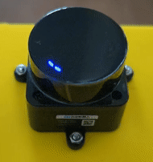

# ROS 2.0 Node for the LD19 LIDAR sensor



This repository contains my ROS 2.0 driver for the LD19 LIDAR sensor. It's quite a compact, low cost lidar sensor with an impressive range of 12 metres. I got the sensor to add to very small robot platforms I've built for experimentaion and learning.

The manufacturer provided a C++ library to parse the data packets from the laser (sadly their is little to no documentation on the packset strucure, I might try and reverse engineer it at some point). That part of the code can be found in  [lipkg.h](.include/ld19_lidar/lipkg.h) and [lipkg.cpp](.include/ld19_lidar/lipkg.cpp).

The node itself has the following parameters:

1. **port** := the serial port address
2. **frame_id** := the laser sensor frame identifier
3. **topic_name** := the ROS 2 topic name to publish the laser scans to

## Install from DockerHub

1. Pull the image

```
docker pull richardw347/ld19_lidar
```

2. Start a new container

```
docker run --device=/dev/ld19_lidar -i richardw347/ld19_lidar

```

## Install from Source

1. Clone the repository into your ROS 2.0 worspace:

```
git clone git@github.com:richardw347/ld19_lidar.git
```

2. Install dependencies:

```
cd ../ && rosdep install --from-paths src
```

3. Build your workspace

```
colcon build
```

4. Launch the driver

```
ros2 launch ld19_lidar lidar.launch.py
```
